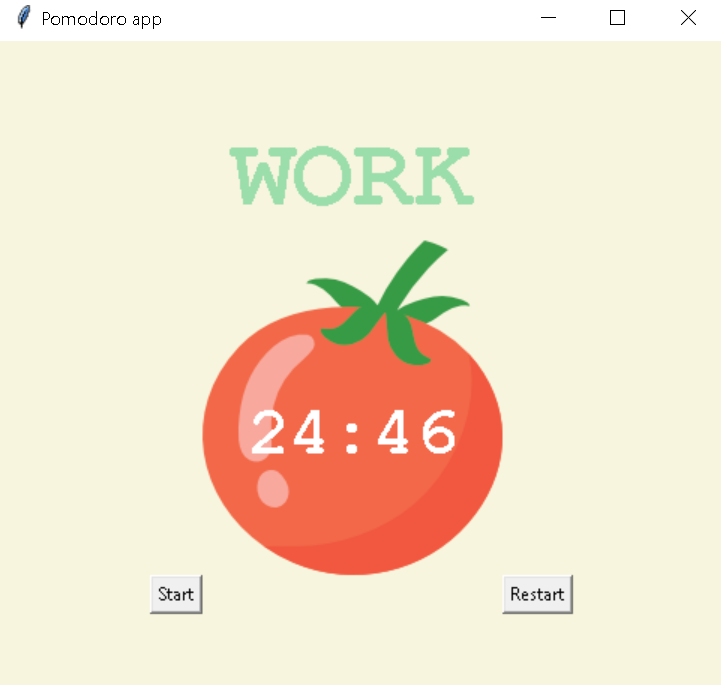
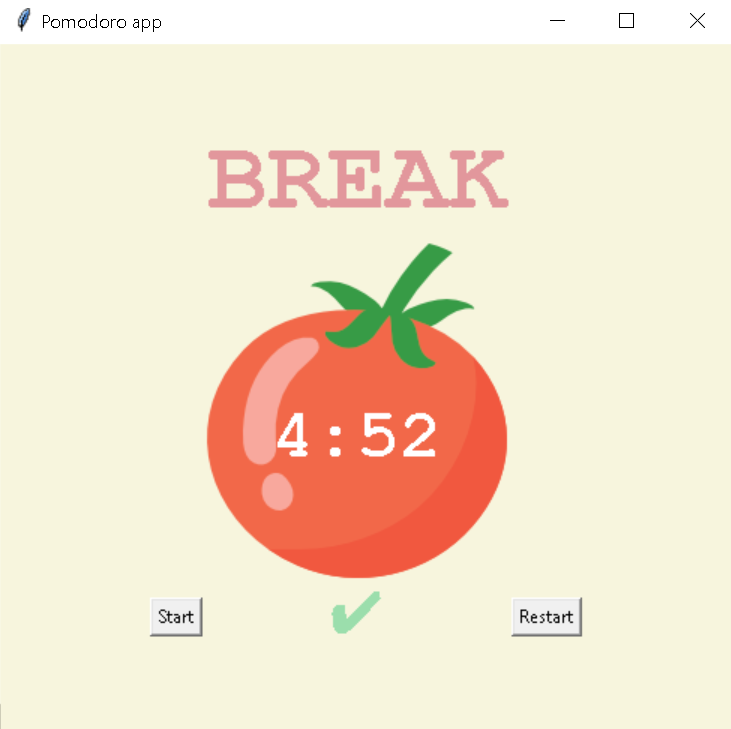

# Pomodorro

## Table of contents

* [About](#about)
* [Screenshots](#screenshots)
* [How to use](#how-to-use)

## About

**Pomodorro** is one of my projects realized in [Python Bootcamp](https://www.udemy.com/course/100-days-of-code/)
Use :tomato: and optimise your work schedule (25 min work -> 5 min break)

## Screenshots

* Work

* Break

## How to use

Simply run the script and press start button to initialize count down timer, after 25 minutes pass take a shot 5 min breake.